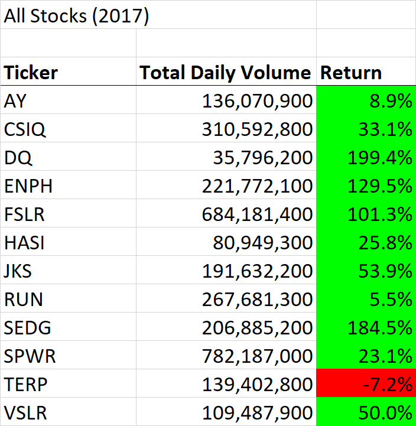
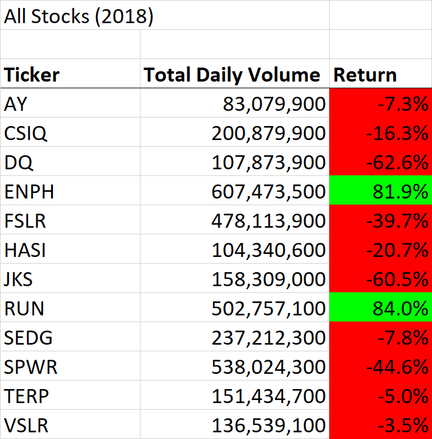
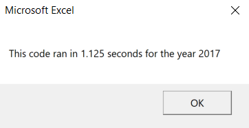
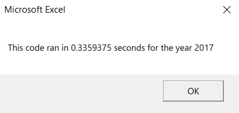
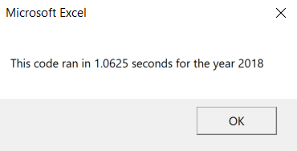
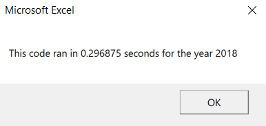

# Stock Analysis
## Overview of Project
### Background
The client for this project was a new financial analyst who wanted to analyze a a number of green energy stocks. In a previous project for this client, a workbook was created using VBA that allowed the client to compute the annual volume and return for each stock with the click of a button. Now, the client wishes to be able to analyze the entire stock market for previous years. 

### Purpose
The purpose of this project was to modify the previous VBA code in order to analyze thousands of stocks for any given year that the client has data for, and to be able to run the analysis in a reasonable amount of time. 

## Results
### Refactoring
The first step in this project was to make three output arrays to hold the calculated annual volumes, starting prices, and ending prices for each stock. The ticker array created in the previous project was used to create a ticker symbol that can be used for each stock. A variable called "tickerIndex" was created in order to match the output arrays with the ticker array. 

Next, a Nested For Loop was written that cycled through the rows in the spreadsheet in order to calculate the outputs for each stock. 

The refactored code and the original code can be seen below (excluding code used for formatting).

***Original***
```
Sub AllStocksAnalysis()

    Dim startTime As Single
    Dim endTime As Single
    
    yearValue = InputBox("What year would you like to run the analysis on?")
    
    startTime = Timer

'1. Format the output sheet on the "All Stocks Analysis" worksheet.

    Worksheets("All Stocks Analysis").Activate
        
    Range("A1").Value = "All Stocks (" + yearValue + ")"
    
    'Create a Header Row
    Cells(3, 1).Value = "Ticker"
    Cells(3, 2).Value = "Total Daily Volume"
    Cells(3, 3).Value = "Return"
    
'2. Initialize an array of all tickers.
     Dim tickers(11) As String
    tickers(0) = "AY"
    tickers(1) = "CSIQ"
    tickers(2) = "DQ"
    tickers(3) = "ENPH"
    tickers(4) = "FSLR"
    tickers(5) = "HASI"
    tickers(6) = "JKS"
    tickers(7) = "RUN"
    tickers(8) = "SEDG"
    tickers(9) = "SPWR"
    tickers(10) = "TERP"
    tickers(11) = "VSLR"
    
'3. Prepare for the analysis of tickers.

    '-Initialize variables for the starting price and ending price.
    Dim startingPrice As Single
    Dim endingPrice As Single
    
    '-Activate the data worksheet.
    Worksheets(yearValue).Activate
    
    '-Find the number of rows to loop over.
    RowCount = Cells(Rows.Count, "A").End(xlUp).Row
        
'4. Loop through the tickers.
    For i = 0 To 11
        ticker = tickers(i)
        totalVolume = 0
        
    '5. Loop through rows in the data.
        Worksheets(yearValue).Activate
        For j = 2 To RowCount
        
            '-Find the total volume for the current ticker.
            If Cells(j, 1).Value = ticker Then
                totalVolume = totalVolume + Cells(j, 8).Value
            End If
            
            '-Find the starting price for the current ticker.
            If Cells(j - 1, 1).Value <> ticker And Cells(j, 1).Value = ticker Then
                startingPrice = Cells(j, 6).Value
            End If
            
            '-Find the ending price for the current ticker.
            If Cells(j + 1, 1).Value <> ticker And Cells(j, 1).Value = ticker Then
                endingPrice = Cells(j, 6).Value
                
            End If
        
        Next j

'6. Output the data for the current ticker.
    Worksheets("All Stocks Analysis").Activate
    Cells(4 + i, 1).Value = ticker
    Cells(4 + i, 2).Value = totalVolume
    Cells(4 + i, 3).Value = endingPrice / startingPrice - 1
    
    Next i

        endTime = Timer
        MsgBox "This code ran in " & (endTime - startTime) & " seconds for the year " & (yearValue)
        
End Sub
```

***Refactored***
```
Sub AllStocksAnalysisRefactored()

    Dim startTime As Single
    Dim endTime  As Single

    yearValue = InputBox("What year would you like to run the analysis on?")

    startTime = Timer
    
    'Format the output sheet on All Stocks Analysis worksheet
    Worksheets("All Stocks Analysis").Activate
    
    'title
    Range("A1").Value = "All Stocks (" + yearValue + ")"
    
    'Create a header row
    Cells(3, 1).Value = "Ticker"
    Cells(3, 2).Value = "Total Daily Volume"
    Cells(3, 3).Value = "Return"

    'Initialize array of all tickers
    Dim tickers(12) As String
    
    tickers(0) = "AY"
    tickers(1) = "CSIQ"
    tickers(2) = "DQ"
    tickers(3) = "ENPH"
    tickers(4) = "FSLR"
    tickers(5) = "HASI"
    tickers(6) = "JKS"
    tickers(7) = "RUN"
    tickers(8) = "SEDG"
    tickers(9) = "SPWR"
    tickers(10) = "TERP"
    tickers(11) = "VSLR"
    
    'Activate data worksheet
    Worksheets(yearValue).Activate
    
    'Get the number of rows to loop over
    RowCount = Cells(Rows.Count, "A").End(xlUp).Row
    
    '1a) Create a ticker Index
    Dim tickerIndex As Integer
    'set to zero
    tickerIndex = 0
    

    '1b) Create three output arrays
    Dim tickerVolumes(12) As Long
    Dim tickerStartingPrices(12) As Single
    Dim tickerEndingPrices(12) As Single
    
    
    ''2a) Create a for loop to initialize the tickerVolumes to zero.
    For tickerIndex = 0 To 11
    tickerVolumes(tickerIndex) = 0
   
   'activate worksheet
    Worksheets(yearValue).Activate
    
        ''2b) Loop over all the rows in the spreadsheet.
        For i = 2 To RowCount
        
            '3a) Increase volume for current ticker
            tickerVolumes(tickerIndex) = tickerVolumes(tickerIndex) + Cells(i, 8).Value
            
            '3b) Check if the current row is the first row with the selected tickerIndex.
            'If  Then
             If Cells(i, 1).Value = tickers(tickerIndex) And Cells(i - 1, 1).Value <> tickers(tickerIndex) Then
                tickerStartingPrices(tickerIndex) = Cells(i, 6).Value
                
                
            'End If
            End If
            
            '3c) check if the current row is the last row with the selected ticker
             'If the next row’s ticker doesn’t match, increase the tickerIndex.
            'If  Then
             If Cells(i, 1).Value = tickers(tickerIndex) And Cells(i + 1, 1).Value <> tickers(tickerIndex) Then
                tickerEndingPrices(tickerIndex) = Cells(i, 6).Value
                
            End If
    
                '3d Increase the tickerIndex.
                 If Cells(i, 1).Value = tickers(tickerIndex) And Cells(i + 1, 1).Value <> tickers(tickerIndex) Then
                    tickerIndex = tickerIndex + 1
                
            'End If
            End If
            
        Next i
        
    Next tickerIndex

      
    '4) Loop through your arrays to output the Ticker, Total Daily Volume, and Return.
    For i = 0 To 11
        
        Worksheets("All Stocks Analysis").Activate
        Cells(4 + i, 1).Value = tickers(i)
        Cells(4 + i, 2).Value = tickerVolumes(i)
        Cells(4 + i, 3).Value = tickerEndingPrices(i) / tickerStartingPrices(i) - 1
        
        
    Next i

    endTime = Timer
    MsgBox "This code ran in " & (endTime - startTime) & " seconds for the year " & (yearValue)

End Sub
```
### Stock Performance
There is a stark difference between the performance of the stocks in 2017 and 2018. In 2017, only one stock had a negative return while in 2018 the majority of the stocks had negative returns. In addition, many of the stocks had a decline in total volume from 2017 to 2018. This may indicate that there is an industry-wide trend, which means that an individual would probably want to invest in a different industry. See below for tables containing the mentioned outputs from the analysis.

***2017 Stock Performance***



***2018 Stock Performance***



### Run Time
Using the new code, the run time for the analysis was significantly shorter for both years. The run time decreased from 1.125 seconds to 0.3359 seconds for 2017, and decreased from 1.0625 seconds to .29688 seconds for 2018. The timer message boxes are below. 

***Original 2017***


***Refactored 2017***


***Original 2018***


***Refactored 2018***


## Summary
